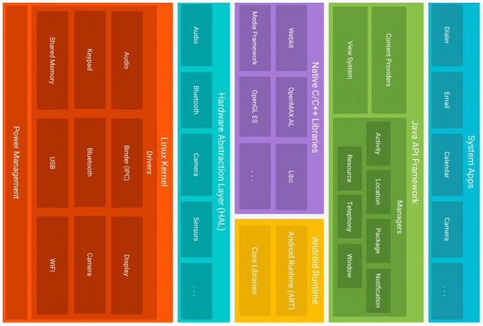

# Android Einführung

**Motivation**: Marktanteil Android weltweit ~70%, schweizweit 44%. Single- vs Multiplatform (Codebase), Native/Hybrid App/Web App. Hybride und Web Apps erreichen nativen Look&Feel über visuelles Styling. Hybride Apps greifen über native Libraries auf Device Featuers zu. Beispiele zu CP Native: Flutter, Xamarin / CP Hybrid: Cordova, Ionic. Vorteile Android SDK: Voller Funktionsumfang, Keine Tools/Einschränkungen von Drittanbietern, Konzepte und Tools sind Basis vieler Frameworks. 

## Grundlagen, Begriffe

**Android**: Seit 2003, Google seit 2005. V1.0 in 2008. Linux-basiert. Entwickelt von Open Handset Alliance, unter Google-Leitung (Android Open Source Project). Lose miteinander gekoppelten Komponenten (Activities, Content Providers, Services und Broadcast Receiver). **Google** ist Gründer der OHA, Mitentwickler von Android und Anbieter wichtiger Services und Apps.

**Fragmentierung** beschreibt die verschiedenen aktuell verbreiteten Android-Versionen. Schuld daran sind Hersteller, die alte Geräte nicht mehr mit neuen Updates versorgen. **Google-Dienste** sind nicht zwingend, beispiel Huawei verwendet AOSP. Bieten oft komfortablere Alternativen zu Standard-Libraries. Wichtig: Google Play Store. 
Wird Code eines API Level verwendet, der höher ist als die minSdkVersion, muss das verwendete Device abgefragt und ein Fallback definiert werden. Um das zu vermeiden gibt es **Android Jetpack / AndroidX**. Erweitert die Android SDK, wird unabhängig von Android entwickelt. Eigene Versionierung. Verwendete Klassen müssen nur erben von AppCompatActivity statt Activity, AppCompatButton statt Button, etc etc.

## Tooling

Android Studio wird von JetBrains zur Verfügung gestellt. Beinhaltet Android SDK und GUI-Wrapper für viele SDK Tools. 

1. Setzen der JAVA_HOME Environment Variable auf korrektes Verzeichnis: `/usr/lib/jvm/jdk-17/bin/` (Huawei Ubuntu in `~/.zshrc` - check mit `echo $JAVA_HOME`).

2. Setting für verwendete Java SDK in Android Studio: Optionen -> Build, Execution, Deployment -> Build Tools -> Gradle.. Einstellung Gradle JDK auf "Android Studio default JDK Version 11.0.13".

### Android SDK

- SDK-Manager:  `/usr/bin/android/cmdline-tools/latest/bin/sdkmanager`
- Plattform Tools inkl. `adb` (Debug Bridge?)
- Platform SDKs  `platforms`
- Emulator:  `/usr/bin/android/emulator/emulator`
- Emulator Images:  `system-images`
- Intel HAXM (Virtualisierung/Emulator Unterstützung)

### Programmiersprache

Grundlegend Java, seit 2019 durch Kotlin abgelöst als von Google empfohlene Sprache zur Entwicklung. Kotlin ist interoperabel mit Java-Code.
