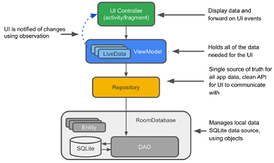

# Android Jetpack

Erweitert die Android SDK, bietet verschiedene Komponenten der Bereiche **Architektur**, UI, Foundation, Behaviour. **Ziel**: Vereinfachen der  Entwicklung von Android-Apps. Wird unabhängig von Android entwickelt *(durch Google aber OpenSource)*, hat auch eigene Versionierung. Verwendete Klassen müssen nur erben von Komponenten der AppCompat Jetpack-Library. `AppCompatActivity` statt `Activity`, `AppCompatButton` statt `Button`, etc etc. Hiess früher Android Support Libraries, Namespace ist `androidx`. Integration durch Android Studio automatisch in neuen Projekten.


**Components vs. Libraries** sind nicht immer Deckungsgleich. Beispiel Library `androidx.lifecycle` enthält die Komponenten `LiveData` und `ViewModel`. **Imports** müssen im Gradle File definiert werden.. In neuen Projekten standardmässig dabei. **Empfehlung:** Verwenden eher selektiv in Applikationen, bei neuen oder wichtigen Projekten mit Prototypen arbeiten.

## View Binding

Ziel: Zugriff vom Controller (Activity) auf Elemente der View vereinfachen, ersetzt `findViewById` Methodenaufrufe. Bietet Typ- und Null-Sicherheit. Erzeugt Code-Klassen beim Build. Automatische Benennung: `activity_main.xml` erzeugt `ActivityMainBinding`-Objekt.

```csharp
android {
	buildFeatures {
		viewBinding true
	}
} // build.gradle
```

```java
public class MainActivity extends AppCompatActivity {
    private ActivityMainBinding binding;
    @Override
    protected void onCreate(Bundle savedInstanceState) {
        super.onCreate(savedInstanceState);
        LayoutInflater inflater = getLayoutInflater();
        binding = ActivityMainBinding.inflate(inflater); // Objekt muss inflated werden
        setContentView(binding.getRoot());	// Seiteninhalt via View Binding definieren
        binding.buttonHello.setOnClickListener(v -> {}); // View Items zugreifen (CamelCase)
    }
}
```

```xml
<LinearLayout
    android:layout_width="match_parent"
    android:layout_height="match_parent">
    <Button
        android:id="@+id/button_hello"
        android:text="Hello World!" />
</LinearLayout>
```

## Data Binding

Ziel: Zugriff von der View auf Elemente im Code (meist Daten im ViewModel) vereinfachen. Variablen im XML generieren, die im Code via `binding`-Objekt verknüpft werden können. Registriert das Layout als Observer der Daten (Achtung: Daten sind deshalb aber nicht zwingend Observable!)

**Vorteile**: Ermöglicht direkte Kommunikation von View zum Model (ohne Controller). Weiter ermöglicht es eine MVVM Implementierung. ViewModel abstrahiert die Logik der View, um sie testbar zu machen. Schlankere Activities und Fragmente.

**Nachteile**: Ohne MVVM wird Model mit Android-Details (ObservableField/Class) belastet. Zu viel Logik im Layout (Expression Language) kann nicht getestet werden. Erschwert Debugging bei Fehlern. Kompiliert langsamer. Gefahr von unsichtbaren Observern.

```csharp
android {
	buildFeatures {
		dataBinding true
	}
} // build.gradle
```

Im XML können Data Binding Expressions (`@{user.name}`) verwendet werden, um auf Eigenschaften der Variable zuzugreifen. Komplexere Optionen möglich mit verschiedenen Operatoren, auch Zuweisung von OnClickListeners.

```java
public class MainActivity extends AppCompatActivity {
    private ActivityMainBinding binding;
    @Override
    protected void onCreate(Bundle savedInstanceState) {
        super.onCreate(savedInstanceState);
        LayoutInflater inflater = getLayoutInflater();
        binding = ActivityMainBinding.inflate(inflater); // Objekt muss inflated werden
	    User user = new User("Thomas", "Kälin");
        SomeViewModel vm = new SomeViewModel();
        binding.setUser(user);
        binding.setVm(vm);
    }
}
```

```xml
<data>
	<variable name="user" type="path.package.my.User" />
    <variable name="vm" type="dev.kuendig.app.SomeViewModel" />
</data>
...
<TextView android:text="@{user.firstName}" />
```

Binding im Layout wird mittels einer **Expression Language** definiert, die einige Operationen anbietet (nicht erlaubt sind `new, this, super`):
_Mathematical: `+ - / * %`, String Concatenation: `+`, Logical: `&& ||`, Binary: `& | ^`, Unary: `+ - ! ~`, Shift: `>> >>> <<`, Comparison: `== > < >= <=` (escape < as `&lt;`), instanceof, Grouping with (), Literals: character string numeric `null`, Casts, Method Calls, Field Access, Array Operator `[]`, Ternary Operator `?:`_

Beispiele: `android:text="@{String.valueof(index + 1)}" android:visibility="@{age > 13 ? View.GONE : View.VISIBLE}"`

**Event Handling:** Attribut `onClick` im XML erwartet eine fixe Methodensignatur (`void doSomething(View view)`). Entweder eine *Method Reference* direkt auf passende Signatur, oder ein *Listener Binding* für komplexere Anwendungen.

```xml
<data><variable name="handler" type="(..).EventHandler" /></data>
<Button android:onClick="@{handler::doSomething}" /> <!-- Method Reference -->
<Button android:onClick="@{v -> handler.doSomething(v, '...')}" /> <!-- Listener Binding -->
```

```java
public class EventHandler { 
	public void doSomething(View view) { /* ... */ }
    public void doSomething(View view, String text) { /* ... */ }
}
```

**Observierbarkeit:** Data Binding erstellt einen Observer, Implementierung von Observable auf der anderen Seite muss aber auch geschehen. Varianten: Observable Field für einzelne Werte, Observable Classes für ganze Klassen. *"Normaler" Java-Observer funktioniert nicht!*

**Two Way Bindings** muss vom XML Attribut auf gegebenem Objekt unterstützt werden. mit `@={user.age}`.

## MVVM - Model View ViewModel

**View:** grafische Oberfläche und Benutzereingaben. **ViewModel:** Logik des UI (Zustände von Buttons, Verifikation von Input), Vermittlung zwischen View und Model. **Model:** enthält Domänen- und Businesslogik. 
*Activity* generiert nur noch View und verknüpft ViewModel.
**Vorteile:** ViewModel einfach testbar, View frei von Logik, Änderungen am Model haben keine direkten Auswirkungen auf die View. **Nachteile:** Data Binding basiert auf Code Generierung (langsamer im Compilen, schwerer zu debuggen). Gefahr, dass Logik in der View platziert wird durch die Expression Language.

**Verschiedene Probleme** bestehen noch mit einer manuellen Implementation bezüglich Lifecycle. **(1)** Unsichtbare Observers: UI kann aktualisiert werden, obwohl die Applikation bzw. Activity nicht mehr im Vordergrund ist. **(2)** Andererseits können Komponenten wie Services Anfragen bzw. Callbacks an nicht mehr vorhandene Elemente schicken. (Stop auf Service, der nie gestartet wurde, Callback auf Activity, die nicht mehr lebt, Start eines Dienstes, der dann endlos weiterläuft.) **(3)** Bei Rotation des Geräts wird das ViewModel auch neu erzeugt, Daten gehen somit verloren.


Ziel: Dienste wie z.B. Location soll selbständig auf Lifecycle-Events reagieren.

Problem (3) wird mit der abstrakten Basisklasse `ViewModel` gelöst: Mehrfache Erzeugung vom ViewModel mit demselben Lifecycle-Objekt liefert immer dasselbe Objekt (Singleton) zurück. Knüpft ViewModels an die Lebenszeit der gesamten App. Erzeugung vom geschieht neu ViewModel via `ViewModelProvider` bzw. ViewModelFactory, falls Parameter nötig sind.

**ViewModel und Fragments**: ViewModel pro Activity kann Kommunikation zwischen Fragments oder Fragment/Activity vereinfachen. Damit verliert das Fragment jedoch teilweise seine Unabhängigkeit.
**Persistenz von UI-State** via ViewModel ist einfach und schnell (in-Memory), bei App-Abstürzen jedoch nicht gesichert.

## Lifecycle-Aware Components

### Interface LifecycleObserver

Löst Probleme (1) und (2) von oben. Setzen das Observer Pattern um, indem ein Objekt mit Lebenszyklus observiert wird. Klasse Lifecycle kapselt den Zustand des beobachteten Objekts. Event wird an alle registrierten Observer geschickt. Kennt Methode `getLifecycle()` zur Übergabe des eigenen Lifecycle an den Listener. **Die Zustandslogik verschiebt sich vom Owner hin zum Observer.**


Lifecycle hält intern den eigenen State als Enum (siehe `getCurrentState`) und kennt Events als Callback-Methoden. LifecycleObserver kann dann diese Callback-Methoden verwenden. 

```java
@OnLifeCycleEvent(ON_START)
void start() { /* ... */ }
@OnLifeCycleEvent(ON_STOP)
void stop() { /* ... */ }
```

### LiveData

Für Data Binding: ein Lifecycle-aware Observable. Also ein Datenobjekt, dass nur Updates liefert, wenn das zugrundeliegende Objekt selber aktiv ist. Alternative zu ObservableFields / ObservableClasses.
im ViewModel `new MutableLiveData<string>()` - Room kann z.b. direkt LiveData zurückliefern.

Registrierung auf dem Lifecycle-Owner ist nötig mit `binding.setLifecycleOwner(this);`

```java
public class MyActivity extends AppCompatActivity {
    @Override protected void onCreate (Bundle savedInstanceState) {
        super.onCreate(savedInstanceState);
        ViewModel viewModel = new ViewModel();
        // vm.name.observe(this, name -> { /* ... */}) wäre die Basis für Data Binding
        binding.setLifecycleOwner(this); // Wie obere Zeile, für alle Objekte im ViewModel
    }
}
```

Zyklus in dieser Grafik ist nicht problematisch, da LiveData die Activity nur als Interface LifecycleOwner kennt:


### Standardarchitektur für Android Apps

Repository-Pattern: Bietet ein "Interface" (Austauschbarkeit) für Persistenzmechanismen. Erlaubt internes Caching. Verbessert Testbarkeit vom ViewModel.


