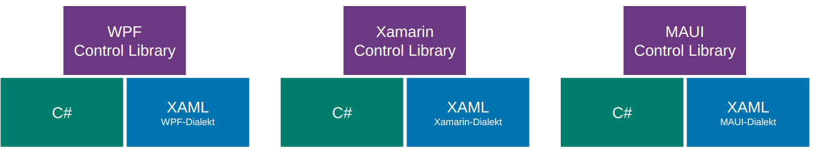
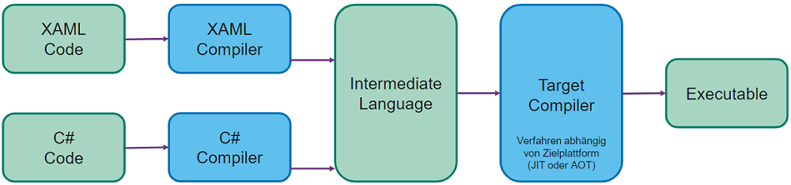
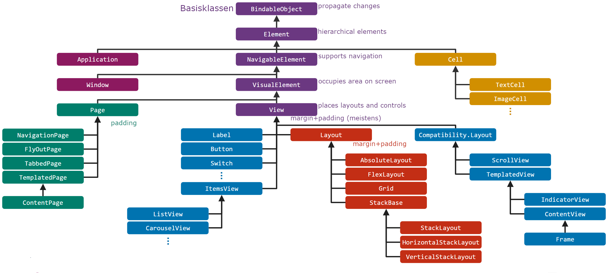
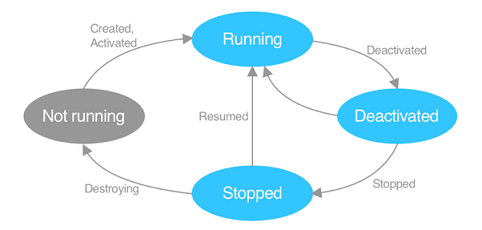
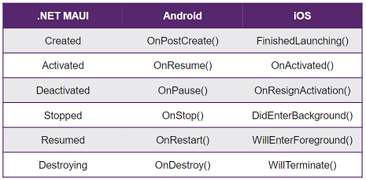

# XAML: eXtensible Application Markup Language

[XAML Grundlagen](https://learn.microsoft.com/en-us/dotnet/maui/?view=net-maui-7.0) : XML basiert, nur in Microsoft (.NET) UI-Framekworks verwendet zur Trennung von Layout und Code. Hierarchisch strukturiert. **Vorteile:** leichtgewichtig, kurz und gut lesbar, Grafischer Designer inkl. Vorschau, Layout durch spezifische Tools erstellbar. Control Libraries: spezifische SDK Bibliothek für Controls, Layouts, Buttons etc.





Ansicht kann in Visual Studio umgeschaltet werden zwischen **Visual Tree** (vollständiger Baum der visuell dargestellt wird, enthält sämtliche Knoten) und **Logical Tree** (Vereinfachung, beinhaltet nur selber definierte Knoten).
**Namespaces** können/müssen im Application Knoten definiert werden:

```xaml
<Application xmlns="http://schemas.microsoft.com/dotnet/2021/maui"
	xmlns:x="http://schemas.microsoft.com/winfx/2009/xaml"
	xmlns:local="clr-namespace:Vorlesung_08"
	x:Class="Vorlesung_08.App">
```

`xmlns` ohne Name ist der Standard Namespace. Üblich: Standard = MAUI Control Library
`xmlns:x` für XAML-spezifisches
`xmlns:local` für eigenes Assembly
`x:Class ="Vorlesung_09.App"` definiert zugehörige Code-Behind Klasse.

**Named Elements:** `x:Name="myElement"`Attribut erstellt ein Property in der generierten Klasse, ermöglicht Zugriff aus Code-Behind. **Event Handler:** Methode aus Code Behind kann in XML registriert werden. Parameter `object sender` ist das auslösende Control. Argumente enthalten Details zum Event (abgeleitet von EventArgs). Bessere Alternativen via VewModel..

```xml
<Button Clicked="Button_OnClicked" Text="Click Me!" />
```

```csharp
private void Button_OnClicked(object sender, EventArgs args) { /* do something */ }
```

**XAML Syntaxen**

```xaml
<Label Text="Attribute Syntax"
       TextColor="Red" />

<Label Text="Property Element Syntax">
    <Label.TextColor>
        <Color>Red</Color>
    </Label.TextColor>
</Label>
```

**Content Properties**: Spezielle Eigenschaft kann direkt als Inhalt des XML-Tags geschrieben werden, kann aufwändige Property Element Syntax vereinfachen. Besser Lesbar bei Parent/Child Beziehungen.

```xaml
<Label Text="Inhalt" /> oder <Label>Inhalt</Label>
<VerticalStackLayout>
	<VerticalStackLayout.Children> <!-- Children ist Content Property von VerticalStackLayout: -->
        <Label>Inhalt</Label>
    </VerticalStackLayout.Children> <!-- kann weggelassen werden -->
</VerticalStackLayout>
```

**Attached Properties:** Setzen einer Eigenschaft auf einem Element, welche zu einem anderen (meist Eltern-) Element gehört. Pendant in Android die `layout_` Attribute.

```xaml
<Grid>
    ... <Label Grid.Row="0" x:Name="Test"></Label>
</Grid>
```

**[Type Converters](https://learn.microsoft.com/en-us/dotnet/maui/fundamentals/data-binding/converters?view=net-maui-7.0)**: Werden verwendet, um im XAML aus meist String-Eingaben verschiedene komplexere Elemente zu parsen (Location, Brush, Color, etc.). Viele Converters sind im .NET Community Toolkit enthalten.

```xaml
<local:LocationControl Center="10, 20" />
```

```csharp
public class LocationControl : Label
{
    public Location Center
    {
        set => this.Text = $"{value.Lat} / {value.Long}";
    }
}
```

```csharp
[TypeConverter(typeof(LocationConverter))]
public class Location
{
    public double Lat { get; set; }
    public double Long { get; set; }
}
```

```csharp
public class LocationConverter : TypeConverter
{
    public override object ConvertFrom(ITypeDescriptorContext context, CultureInfo culture,         object value)
    {
        // Zur Kürzung des Beispiels auf Checks verzichtet:
        // - Ist value wirklich ein string? Enthält das Array exakt 2 Elemente?
        // - Sind die strings zu double konvertierbar?
        var valueAsString = (string) value;
        var valueArray = valueAsString.Split(',');
        return new Location
        {
            Lat = Convert.ToDouble(valueArray[0]),
            Long = Convert.ToDouble(valueArray[1])
        };
    }
}
```

**Markup Extensions** erlauben Logik in XAML, häufig für Styling oder Data Binding verwendet. Auch eigene Extensions möglich. Aufzurufende Funktion innerhalb `{ }`

```xaml
<Label Text="Mein Text" FontFamily="{x:Null}" />
<Label Text="{local:LocationExtension Lat=10,Long=20}" />
```

```csharp
public class LocationExtension : IMarkupExtension<string>
{
    public string Latitude { get; set; }
    public string Longitude { get; set; }
    public string ProvideValue(IServiceProvider sp) => Latitude + " / " + Longitude;
    object IMarkupExtension.ProvideValue(IServiceProvider sp) => ProvideValue(sp);
}
```

## GUI-Grundelemente

Basisklassen bieten schrittweise weitere Funktionalität an alle von ihnen ableitenden Klassen an.



Grundlegender Aufbau einer Seite (--> enthält 1 oder mehrere von)


**Application:** MainPage definiert ersten angezeigten Screen, erzeugt und verwaltet Fenster. Verarbeitung von **Lifecycle Events** in überschreibbaren Methoden (für alle Fenster). Zentrale Verwaltung von **app-weiten XAML** Ressourcen.

**Window:** Definiert ein einzelnes Fenster inkl. Lifecycle Methoden, zum Überschreiben ist eine eigene Ableitung von Window nötig. Weitere Fenster werden via Application erzeugt: `Application.Current.OpenWindow(window);`
Events: `Created, Activated, Deactivated, Stopped, Resumed, Destroying`

**[Lifecycle](https://learn.microsoft.com/en-us/dotnet/maui/fundamentals/app-lifecycle?view=net-maui-7.0)**: Events können im Window oder reduziert in Application verarbeitet werden.



Grau: Nicht im Memory geladen.



## Pages

Elemente zur Strukturierung und Gestaltung von Screens. Verschachtelung üblich. **Content Page** (leer), **Flyout Page ** (Benötigt NavigationPage für korrekte Darstellung. Seitlich "einfliegende" Content Page), **Navigation Page** (Titel Bar mit Back Button), **Tabbed Page** (Vereint mehrere ContentPages mittels Tab Navigation)

### Navigation

Modal: Vordefinierte Abfolge von Fenstern, kann nicht einfach geschlossen werden
Modeless: Navigation Stack, User kann jederzeit zurück navigieren. `NavigationPage` benötigt.

Varianten: **Application.MainPage**, Austausch der angezeigten Page (nur sehr einfache Apps). **NavigableElement.Navigation** (s.oben, modeless oder modal), **Shell** (Navigation mittels URIs)

## Layouts

Sind Container für Kind-Elemente => Composite Design Pattern. Verschachtelung möglich (analog Android).
Zur Ausrichtung von Kind-Elementen im Layout wird `HorizontalOptions` und `VerticalOptions `verwendet. Varianten sind `Start`(links/oben), `Center`(zentriert), `End` (rechts/unten), `Fill` (Platz füllen, Standard). Layouts berücksichtigen Kultureinstellungen wie Left-to-Right/Right-To-Left Text.

**StackLayout**: `Horizontal-` oder `VerticalStackLayout` möglich. "StackLayout" ist veraltet.
**FlexLayout**: Wie Stack aber mit Wrapping und mehr Gestaltungsmöglichkeiten. `Direction="[Row|Column]"`, `Wrap="Wrap"`, `JustifyContent`, `AlignItems` zur Verteilung der Items auf beiden Achsen.
**Grid**: Flexibles, verbreitetes Layout mit Zeilen und Spalten. Sehr mächtig. Grössen: `1*, 2*, 3*` = relative Einheiten. einmalig `*` vergeben für *"brauche restlich verfügbaren Platz"*. `auto` wie Android `wrap_content` (Achtung Overhead, Koordination durch Elternlayout). Mehrere Elemente in der selben Zelle werden auf der z-Axis gestapelt (=> gut für Background Image). Weitere Werte sind `Row/ColumnSpacing`(Abstand), `Row/ColumnSpan`(Verbundene Zellen).
**AbsoluteLayout**: Gut für Overlays, Karten mit Controls etc. Absolute (selten) oder proportionale Werte (in Prozent vom Elternelement, zw. 0.0-1.0). Wertetypen sind Kombinierbar.

## Views

Auch Controls oder Widgets. Sind Elemente, die für den Benutzer "interagierbar" sind. MAUI bildet diese via Handlers auf Plattform-native Views ab.

| Typ               | Beispiele                                      |
| ----------------- | ---------------------------------------------- |
| Darstellung       | Label, Image, Border, Frame, ScrollView, ...   |
| Eingaben          | Entry, CheckBox, Slider, Switch, ...           |
| Aktionen          | Button, ImageButton, SearchBar, ...            |
| Aktivitätsanzeige | ActivityIndicator und ProgressBar              |
| Collections (W11) | Picker, ListView, CarouselView, TableView, ... |

**Grössenangaben:** in MAUI immer Device-Independent Units. Relative Werte ohne Einheit, Umrechnung auf plattformspezifische Werte bei Ausführung. Sind nur **Wünsche** an die Rendering-Engine (Minimum- / MaximumHeightRequest). Ohne Grössenangabe wird View "so gross wie nötig" bzw. wie in Android `wrap_content` dargestellt.

**Margin und Padding:** Pages haben Padding, Layouts und Views Margin und Padding. Mögliche Werte sind `all` / `horizontal,vertical` / `l,t,r,b`

