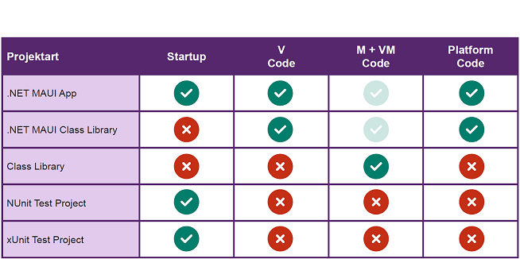
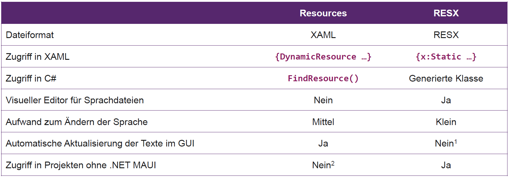

# MAUI Architektur 1

## Solution Design: Schnitte zur Zerlegung

Ziel: Trennung von UI und Nicht-UI, aufgrund Testbarkeit. Wartbarkeit, Qualität, Überblick. Trennung möglich nach technischer Verwendung, Fachlichkeit, Organisation. "Schnitt" kann sein Trennung in Projekte, Namespaces, Ordner.
***Kriterien ISO 25010:** Portability, Functional Stability, Reliability, Performance, Compatibility, Usability, Security, Maintainability*

**Horizontal**: Technische Trennung, traditioneller Ansatz. Geeignet für Technologie Teams, Austausch von Technologien wird einfacher. **Vertikal:** Fachliche Trennung, modernerer Ansatz. Agile Implementation nach Features, Geeignet für Feature Teams. Technologie-Austausch schwieriger.
**Kombination:** Trennung fachlich, innerhalb dann nochmals nach Technik. **Kleinprojekte:** Keine Trennung nötig, solange Übersicht gegeben ist. **Technologische Trennung:** .NET MAUI spezifisch separat, alles andere zusammen.

**Projekttypen:** Class Library, Standard Projektform, ergibt eine DLL. Beinhaltet View Model, Model. .NET MAUI Projekt - Platform APIs und View, greift auf die Class Library zu. Testprojekt greift ebenfalls auf Class Library zu.




## Dependency Inversion Principle

= Programmieren gegen Abstraktionen anstelle konkreter Implementationen. 
Beispiele: Adapter für List- oder RecyclerViews. Callback-Interfaces für Fragmente, Observer Pattern, Data Binding, ICommand, DelegateProperties auf ViewModel.

### Dependency Injection

Mechanismus zur Ausführung von Technologie-spezifischen Aufgaben getriggert aus der Domänenlogik. Client kennt Service nur als Interface. **Injector** erzeugt Service und Client, injiziert Abhängigkeiten via Konstruktor, Methode oder Property. Service kann in Tests durch ein *Test Double* ersetzt werden.


**Vorteile:** Geringere Kopplung, Separation of Concerns, Austauschbarkeit, Erhöhte Testbarkeit, Weniger Glue Code im Client **Nachteile:** Zusätzliche Komplexität, Erschwertes Debugging, Parameterliste wächst bei vielen Abhängigkeiten, Mehr Glue Code im Injector
**Grundmuster/Ablauf in MAUI:** 1. Interface für Verhalten definieren 2. Interface im ViewModel verwenden 3. Interface im MAUI-Projekt implementieren 4. Service im MAUI-Projekt erzeugen 5. ViewModel im MAUI-Projekt erzeugen 6. Service in ViewModel injizieren.
**DI Container** übernimmt die Zuweisung von Interface und expliziter Implementation. Kann zur einfacheren Erstellung von z.B. View Models verwendet werden. Nützlich bei grossen Projekten mit vielen Abhängigkeiten. Fertige Implementierungen als Tools verfügbar. *Achtung*: Fehler bei Konfiguration wirken sich erst zur Laufzeit aus. In Clean Architecture typischerweise im Äussersten Ring implementiert.
**Testing:** Unit Tests können von DI stark profitieren, wenn Testprojekt als zusätzliche View eingeordnet wird. Implementierung der Services für Tests als Doubles klar und abgegrenzt möglich. Mocking Libraries verfügbar zur Unterstützung.

## Platform Integration

MAUI bietet viele APIs für plattformspezifische Funktionen an. Filezugriff, Main Thread, Browser, Karten, etc... Gibt es keine MAUI API, muss für jede Plattform eine eigene Implementierung gemacht werden. Dazu gibt es 2 Varianten.

**Conditional Compilation**: Alle Implementierungen in einer Datei, Unterscheidung via Direktiven. Code wird schnell schlecht lesbar. 

```csharp
#if ANDROID
    IWindowManager windowManager = ...
#elif IOS
    UIInterfaceOrientation orientation = ...
#else
    throw new NotImplementedException();
#endif
```

**Multi-Targeting** trennt über Projekteinstellungen und Filenamen. Bevorzugter Weg in MAUI.


## Threading

Android: ANR Screen wenn UI Thread blockiert ist. Langlaufende Operationen via `Runnable` in eingenen Thread ausführen. Wirft Exceptions / nicht möglich: Langlaufende Operation auf Main Thread, Aktualisierung des GUI aus Background Thread.

.NET Lösungen zum Threading: Task, async / await, Parallel LINQ (PLINQ)

```csharp
Task.Run(() =>
{
    // Ausführung auf Background-Thread, Läuft *parallel* zum Main-Thread!
    Thread.Sleep(2000);
    MainThread.BeginInvokeOnMainThread(() =>
    {
        // Ausführung auf Main-Thread, Hier darf das GUI aktualisiert werden
    });
}); // Main-Thread läuft hier *parallel* zum Task weiter
```

**`MainThread`** als Klasse ist Teil von MAUI Platform Integration. Aufruf mit synchroner und asynchroner Variante (`BeginInvokeOnMainThread / InvokeOnMainThreadAsync`).

Auswirkungen: **Data Binding** in MAUI macht die Aktualisierung von Views im UI nach Data-Bound Funktionen automatisch auf dem Main Thread. Properties Verändern von Background Thread also möglich. **Relay Command** muss im CanExecutechanged Event explizit einen Dispatch auf Main Thread machen.

## Mehrsprachigkeit

**Resources:** Einzelne Datei mit String Resources pro Sprache, die die Übersetzungen beinhalten. Zugriff via MarkupExtension StaticResoure/DynamicResource. *Variante Mit DynamicResource*: Key der Resource ist überall gleich, laden eines anderen File via Reflection möglich. _Variante ist spezifisch .NET MAUI. Zugriff von Non-UI schwierig. Translation-Service muss definiert und in .NET MAUI-Projekt implementiert werden → technologische Grenze_

```csharp
public void LoadTranslations(string key)
{
    var assembly = "MyApp";
    var type = $"MyApp.Translations_{key}";
    var rd = Activator.CreateInstance(assembly, type).Unwrap();
    foreach (var rdKey in rd.Keys)
    {
        Resources[rdKey] = rd[rdKey];
    }
}
```

**RESX (Standard .NET):** XML Resources, Definition derselben Strings in speziellen RESX-Files. Ein File pro Sprache. .NET generiert eine Klasse mit demselben Namen wie das File, via Markup Extension `x:Static` kann auf normale .NET Klassen zugegriffen werden. `t:Translations.Key1` bezeichnet den genauen Wert.

```xml
<?xml version="1.0" encoding="utf-8"?>
<root>
    <data name="Key1" xml:space="preserve">
        <value>Translation 1</value>
    </data>
</root>
```

```xaml
<ContentPage xmlns:t="clr-namespace:MyApp.Translations">
	<Label Content="{x:Static t:Translations.Key1}" />
</ContentPage>
```

```csharp
public void LoadTranslations(string key) // Key kann z.B. "de" oder "en-US" sein
{ Translations.Culture = new CultureInfo(key); }
```

Zugriff auf die generierte Klasse aus jedem C# File möglich. **Nachteile**: UI aktualisiert nicht automatisch, statisch eingebunden. **Vorteil:** Angenehme Verwaltung in GUI Tool.



### Translation Service

Verstecken der MAUI-Resources Funktionalität hinter einem Interface um einen TranslationService anzubieten. Gut für Austauschbarkeit, Halten von Übersetzungen auf Properties im ViewModel.