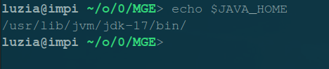
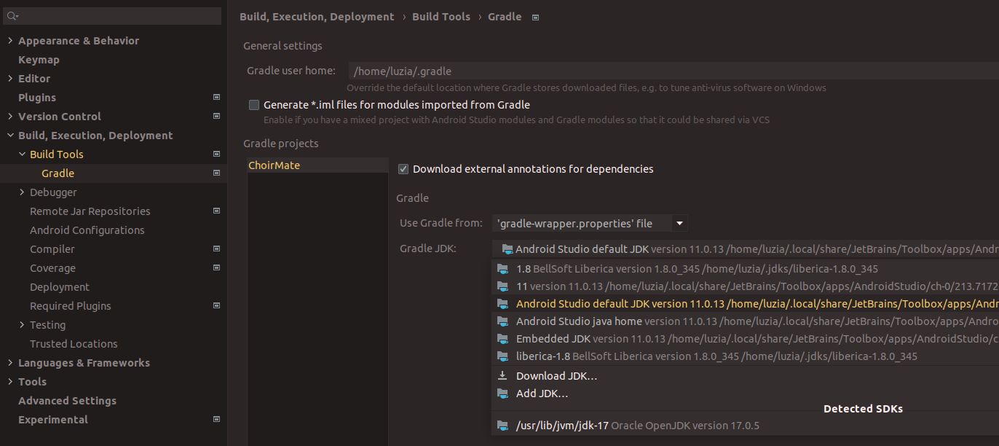

# Vorlesung 01

_Slides `Anhang': Nicht Prüfungsrelevant._

## Grundlagen, Begriffe

Android basiert grundlegend auf lose miteinander gekoppelten Komponenten (Activities, Content Providers, Services und Broadcast Receiver).

### Fragmentierung

Beschreibt die verschiedenen aktuell verbreiteten Android-Versionen. Schuld daran sind Hersteller, die alte Geräte nicht mehr mit neuen Updates versorgen.

### Google-Dienste

Nicht gegeben, beispiel Huawei verwenet auf Geräten keine Google-Dienste mehr. AOSP -> Android Open Source Project.
Bieten oft komfortablere Alternativen zu Standard-Libraries. Wichtig: Google Play Store.

### Rückwärtskompatibilität

`minSdkVersion`: Ältere Geräte können meine App nicht nutzen
`maxSdkVersion`: nutzlos?
`targetSdkVersion`: gibt an, auf welche Version die App getestet ist und sicher stabil läuft

`compileSdkVersion`: wird so kompiliert, beinhaltet neue Funktionen, aber diese werden nicht verwendet (?)

Wird Code eines API Level verwendet, der höher ist als die minSdkVersion, muss das verwendete Device abgefragt und ein Fallback definiert werden.

Um das zu vermeiden gibt es Android Jetpack / AndroidX.
Erweitert die Android SDK, wird unabhängig von Android entwickelt. Eigene Versionierung.

Verwendete Klassen müssen nur erben von AppCompatActivity statt Activity, AppCompatButton statt Button, etc etc.

## Tooling

Android Studiio wird von JetBrains zur Verfügung gestellt. Beinhaltet Android SDK und GUI-Wrapper für viele SDK Tools.

Setzen der JAVA_HOME Variable auf korrektes Verzeichnis:

Setting für verwendete Java SDK in Android Studio:

### Android SDK

- SDK-Manager:  
`/usr/bin/android/cmdline-tools/latest/bin/sdkmanager`
- Plattform Tools inkl. `adb` (Debug Bridge?)
- Platform SDKs  
`platforms`
- Emulator:  
`/usr/bin/android/emulator/emulator`
- Emulator Images:  
`system-images`
- Intel HAXM (Virtualisierung/Emulator Unterstützung)

### Programmiersprache

Grundlegend Java, seit 2019 durch Kotlin abgelöst als von Google empfohlene Sprache zur Entwicklung. Kotlin ist interoperabel mit Java-Code.

## App Bestandteile

### Activity

Besitzt eine graphische Oberfläche und verarbeitet Benutzereingaben, eine Activity = eine Aufgabe.
Main Activity wird beim App-Start ausgeführt. 
Beim Activity Start: onCreate -> setContentView verknüpft java activity mit XML file
Ereignisse im XML File werden via __Listener__ verarbeitet.

__Lebenszyklus__, terminieren bei Bedarf: Zustände und Callbacks

### Resources

Werden im Java Code über die `R' Klasse angesprochen.
Value Resources werden in separaten Files nach Typen gruppiert: Farbwerte, Dimensionen, Texte, Styles
__Qualifiers__ im Dateinamen können verwendet werden, um spezifisch auf Endgerät verschiedene Informationen zu laden.

### Manifest

Enthält alle Informationen die Android braucht, um die App installieren und darstellen zu können.
ID, Name, Version und Logo, enthaltene Komponenten, Hard- und Softwareanforderungen, benötigte Berechtigungen.
Wird beim build um Informationen aus \emph{build.gradle} erweitert.
VersionName (freitext) vs. versionCode (positiver Integer)

### Intents

Dienen zur Kommunikation zwischen Komponenten.
Expliziter Intent: Zeige einen spezifischen Screen
Impliziter Intent: Zeige eine passende Komponente für die aktuelle Aktion (erst prüfen, ob eine passende App vorhanden ist. zeile im android manifest (query all packages permission))

Für die Registration auf implizite Intents werden im Android MAnifest Intent Filters verwendet.

startActivity(Intent)
startActivityForResult(Intent)

### Tasks

Back Stack wird einem Task zugeordnet (Overview Screen zeigt verschiedene Tasks)

