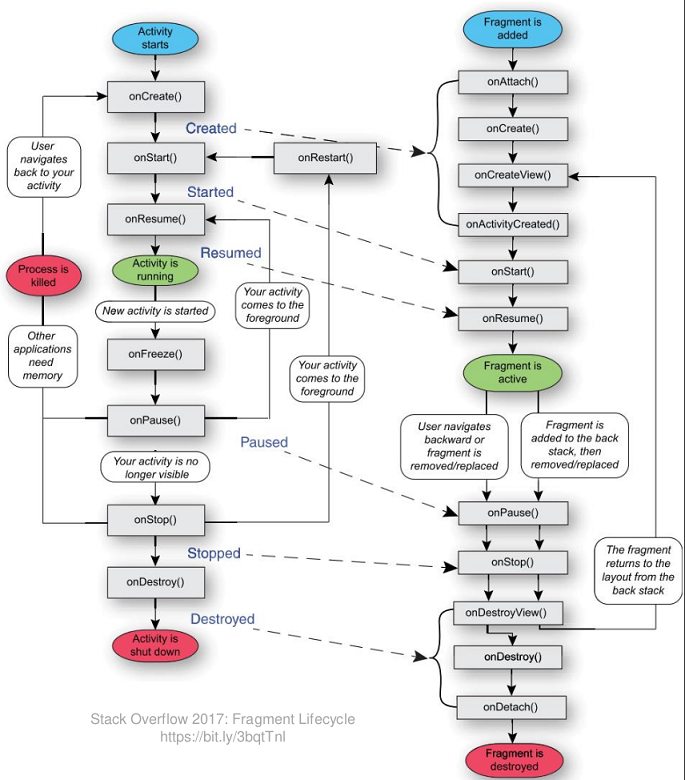
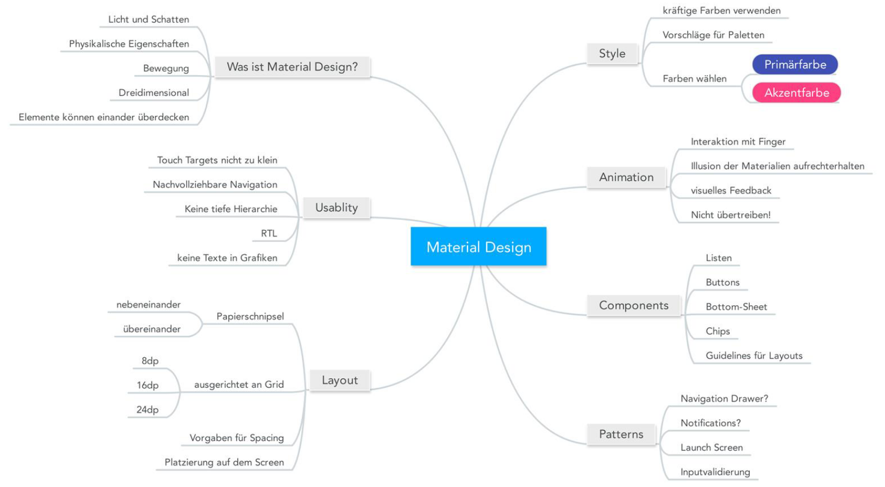
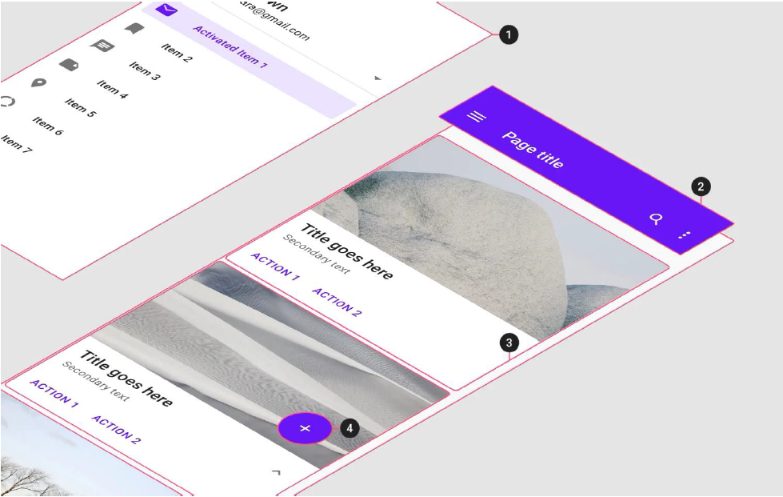

# Android Strukturierung, Styling, Material Design

## Strukturierung mit Fragments

Activities füllen zwingend immer einen kompletten Screen. Mehrere in sich geschlossene Elemente auf einen Screen können mit Fragments erreicht werden. Fragments haben einen eigenen **Lebenszyklus** und können auch mehrfach auf einen Screen eingebunden werden. _Fragments sind in der Android SDK "deprecated", werden aktueller in AndroidX / Jetpack geführt. Verwendung: `androidx.fragment.app.* / getSupportFragmentManager()`_. 
**Lifecycle Callbacks ** zusätzlich: `onAttach/onDetach` (Fragment an Activity), `onCreateView/onDestroyView` (Fragment erstellen/zerstören), `onActivityCreated`. Parameter werden immer als `Bundle` übergeben, nie als Konstruktor.
**Vorteile**: Wiederverwendbarkeit, Wartbarkeit (kleinere Codeblöcke), Flexibilität durch mögliche Unterscheidung Smartphone vs. Tablet. **Verschachtelung** möglich, innerhalb Fragment kann `getChildFragmentManager()` verwendet werden.



**Statische Einbindung**: Verhalten wie Activities. Erlaubt keine/kaum Interaktion zwischen Activity und Fragment.

```
(MainActivity.java -(setContentView)-> activity_main.xml -(xml-fragment)-> outputFragment.java -(super(R.id....))-> fragment_output.xml)
```

**Dynamische Einbindung**: Platzhalter `FragmentContainerView` im XML. Activity verwendet Objekt `FragmentManager`. *Vorteile*: Austauschbar zur Laufzeit, Parameterübergabe möglich, reagieren auf Ereignisse im Fragment möglich. Ebenso sind Animationen möglich beim Austauschen, definition in XML Files `res/anim`. Add to Back Stack ist optional.

```xml
<?xml version="1.0" encoding="utf-8"?>
<androidx.constraintlayout.widget.ConstraintLayout 
    ...
    <androidx.fragment.app.FragmentContainerView
        ...
        tools:layout="@layouts/fragment_infos" />
/>
```

```bash
Fragment Manager = getSupportFragmentMAnager()  
Fragment Transaction = mgr.beginTransaction()
```

Kommunikation Activity >> Fragment 

- Informationen können via Bundle-Objekt übergeben werden.
- Erstellen und übergeben von Bundle mit `OutputFragment.create()` (Java) bzw. `newInstance()` (Kotlin).  
  Deshalb weil der Konstruktor-Parameter nicht neu ausgeführt wird, z.B. bei Rotation des Gerätes.
- Public Methoden auf dem Fragment können von der Activity aufgerufen werden.

Kommunikation Fragment >> Activity __nur__ via Implementation von Callback-Interface (Dependency Inversion).

```java
public interface OutputFragmentCallback { void onTextTapped(String text); }
public class MainActivity implements OutputFragmentCallback {
    @Override public void onTextTapped(String text) {
        // was passiert on tap?
    }
}
public class OutputFragment extends Fragment {
    private OutputFragmentCallback callback;
    @Override public void onAttach (Context context) {
        super.onAttach(context);
        try {
            callback = (OutputFragmentCallback) context;
        } catch (ClassCastException e) { /* exception handling */ }
    }
    @Override public void onViewCreated(View view, ... ) {
        textOutput = view.findViewById(R.id.output_text);
        textOutput.setOnClickListener(v => { callback.onTextTapped("..."); });
        return fragment;
    }
}
```

## Styling mit Themes

Probleme von Attributen direkt auf XML Elementen: Code-Duplizierung, Inkonsistenzen und Unübersichtlichkeit. **Styles** sind Value-Resourcen in `res/values/styles.xml`, die Formatierungen wiederverwendbar machen. Qualifiers auch möglich. Werden vom Build System ausgewertet. 

```xml
<style name="HeaderText">
    <item name="android:textSize">24sp</item>
    <item name="android:background">#ff9999</item>
    <item name="android:padding">8dp</item>
    <item name="android:layout_margin">8dp</item>
    <item name="android:gravity">center</item>
</style>
<style name="HeaderText.Big"> <!-- Vererbung möglich, beinhaltet auch alle Werte von HeaderText -->
    <item name="android:textSize">40sp</item> <!-- Variante 2: parent-Attribut setzen -->
</style>
<!-- Anwendung in Layout -->
<TextView
    android:layout_width="match_parent"
    android:layout_height="wrap_content"
    android:text="Element 1"
    style="@style/HeaderText" />
<TextView
    android:layout_width="match_parent"
    android:layout_height="wrap_content"
    android:text="Element 2"
    style="@style/HeaderText.Big"/> <!-- Kein Namespace! -->
```

**Themes**: Standard-Style kann für ganze App oder Activity festgelegt werden. Nur noch Abweichungen müssen als Style definiert werden. Theme in `res/values/styles.xml`, `parent`-Attribut definiert Abhängigkeit von allgemeinen Themes. 

```xml
<resources>
    <style name="AppTheme" parent="…"> <!-- Parent definiert Grund-Theme -->
        <item name="android:textViewStyle">@style/MyText</item> <!-- Macht MyText Standard f. TextView --> 
    </style>
    <style name="MyText">
        <item name="android:textSize">24sp</item>
        <item name="android:background">#ff9999</item>
        <item name="android:padding">8dp</item>
        <item name="android:layout_margin">8dp</item>
        <item name="android:gravity">center</item>
    </style>
</resources>
```

**Einbindung** vom Theme im Manifest in Application/Activity XML Node, oder via `setTheme()` in `onCreate()` Methode.

```xml
<application … android:theme="@style/AppTheme">
	<activity … android:theme="@style/AnotherAppTheme" />
</application>
```

```java
@Override
protected void onCreate(Bundle savedInstanceState) {
    setTheme(R.style.AnotherAppTheme); // ZWINGEND VOR setContentView
    setContentView(R.layout.activity_styling);
}
```

Hierarchie der verschiedenen Definitionen: **Attribute via Code** vor **Attribute via XML** vor **Style via XML** vor **Standard-Styles** vor **Theme** vor **TextAppearance (Material Design)**

## Material Design

Einbinden: Android SDK mit `Theme.Material.*`, AndroidX mit `Theme.AppCompat.*`, beste Unterstützung mit **Material Components Library**: `Theme.MaterialComponents.*`

Design Language von Google. Hilfestellung für Designprozess. Beschreibt, wie einzelne Teile der Applikation aussehen und sich verhalten sollten. Teils Regeln, teils Empfehlungen und Beispiele. **Ziel**: konsistentes und benutzbares Look-and-Feel, möglichst systemweit. Beispiel von *Human-Interface Guidelines*.



Ideen: ***Material is the Metaphor***: Material ist immer 1dp dick, wie Papier. Material wirft Schatten. Material hat eine unendliche Auflösung -> SVG-Grafiken. Inhalt hat keine Dicke und ist Teil des Materials. ***Bold, graphic, intentional: *** basiert auf prinzipien von Print-Medien bezgl. Hierarchie, Raster, Schriften, Farben, ...  ***Motion provides Meaning***: Material kann sich verändern. Material kann sich bewegen. Bewegung bedeutet Aktion -> Zurückhaltend verwenden.

**Farben:** Primärfarbe in verschiedenen Abstufungen, optionale Sekundär-/Akzentfarbe. Tools existieren zur Farbwahl. Anpassen in Themes, `colorPrimary, colorPrimaryDark, colorAccent` etc., gilt für viele Controls. **Icons:** Library von Material Design zur freien Verwendung **Layouts:** 8dp Raster ist Basis für Ausrichtung **Components:** Material Design umfasst zusätzliche Software-Libraries mit GUI Elementen (Controls) **Text:** Vordefinierte Styles mit `style` oder `android:textApperance` Attribut auf `@style/TextAppearance.MaterialComponents.Headline3`.



Einbindung prüfen, wenn die IDE vorschlägt... Button z.b aus AndroidSDK, AndoridX, Material Design möglich.

**Material You**: Android 12+ als weiterentwicklung von Material Design, um wieder mehr Individualisierung in die Apps zu bringen. Mehr Farben, mehr Animationen, mehr *abgerundete Ecken*.
