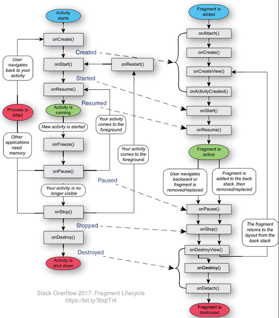

# Android Strukturierung, Styling, Material Design

## Strukturierung mit Fragments

Activities füllen zwingend immer einen kompletten Screen.
Mehrere in sich geschlossene Elemente auf einen Screen können mit Fragments erreicht werden.

_Fragments sind in der Android SDK "deprecated", werden aktueller in AndroidX / Jetpack geführt._

Fragments haben einen eigenen Lebenszyklus und können auch mehrfach auf einen Screen eingebunden werden.



Vorteile bei der Verwendung von Fragments:

- Wiederverwendbarkeit
- Wartbarkeit (kleinere Codeblöcke)
- Flexibilität (Smartphone vs. Tablet)

### Statische Einbindung

Verhalten wie Activities. Wird im XML der "Eltern-Activity" eingebunden, referenziert ebenso einen Java/Kotlin Teil.

Erlaubt keine/kaum Interaktion zwischen Activity und Fragment.

```bash
(Main Activity.java -(setContentView)-> activity_main.xml -(xml-fragment)-> outputFragment.java -(super(R.id....))-> fragment_output.xml)
```

### Dynamische Einbindung

Im Activity XML wird nur ein Platzhalter generiert, der zur Laufzeit befüllt wird.

```xml
<?xml version="1.0" encoding="utf-8"?>
<androidx.constraintlayout.widget.ConstraintLayout xmlns:android="http://schemas.android.com/apk/res/android"
    xmlns:app="http://schemas.android.com/apk/res-auto"
    xmlns:tools="http://schemas.android.com/tools"
    ...

    <androidx.fragment.app.FragmentContainerView
        ...
        tools:layout="@layouts/fragment_infos" />
/>
```

```bash
Fragment Manager = getSupportFragmentMAnager()  
Fragment Transaction = mgr.beginTransaction()
```

- Informationen können via Bundle-Objekt übergeben werden.

- Erstellen und übergeben von Bundle mit `OutputFragment.create()` (Java) bzw. `newInstance()` (Kotlin).  
Deshalb weil der Konstruktor-Parameter nicht neu ausgeführt wird, z.B. bei Rotation des Gerätes.

- `addToBackStack()` erlaubt wechseln zwischen Fragmenten via "Back" Button

- Public Methoden auf dem Fragment können von der Activity aufgerufen werden.

- Kommunikation von Fragment zu Activity __nur__ via Implementation von Callback-Interface (Dependency Inversion)

- Können auch in sich verschachtelt werden, genau gleich wie bei der Activity nur der Manager heisst anders (`getChildFragmentManager()`). Wird selten verwendet.

- __Anzeige im Designer:__ Mittels `tools:layout`-Annotation kann der Vorschau von Android Studio mitgeteilt werden, welches Fragment eingebunden werden soll.

## Styling

res/values/styles.xml

wird vom Build System ausgewertet, referenz im XML nur mit `style="@style/HeaderText"`, kein android: davor.

Vererben von Styles auch möglich, HeaderText.Big überschreibt z.B. nur einzelne Werte von HeaderText.

Themes: Standard-Style kann für alle Elemente festgelegt werden. Nur noch Abweichungen müssen als Style definiert werden.
Theme in res/values/styles.xml, parent-Attribut definiert Abhängigkeit von allgemeinen Styles. Referenz auf Style-Objekte definiert dann den Standard, überschreiben von android:textViewStyle zum Beispiel.

Einbindung vom Theme im Manifest in Application/Activity XML Node, oder via `setTheme()` in `onCreate()` Methode.

Hierarchie der verschiedenen Definitionen:


## Material Design


### Basics

Designsprache: einheitliche visuelle Sprache, die über die ganze Applikation verwendet wird.

Ähnlich Coding Guidelines.

Ziele:

- Konsistentes und benutzbares Look and Feel, innerhalb Applikation UND systemweit.

Ideen

- Material ist immer 1dp dick
- Material wirft Schatten
- Material hat eine unendliche Auflösung -> SVG-Grafiken
- Inhalt keine Dicke und ist Teil des Materials
- Material kann sich verändern
- Material kann sich bewegen

### Farben

Primär- und Sekundärfarbe, in verschiedenen Abstufungen.

### Icons

Library von Material Design bereitgestellt zur freien Verwendung.

### Layouts

8dp Raster ist Basis für Ausrichtung.

### Components

Material Design umfasst zusätzliche Software-Libraries mit GUI Elementen (Controls).

Einbindung prüfen, wenn die IDE vorschlägt...
Button z.b aus AndroidSDK, AndoridX, Material Design möglich.

