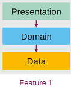
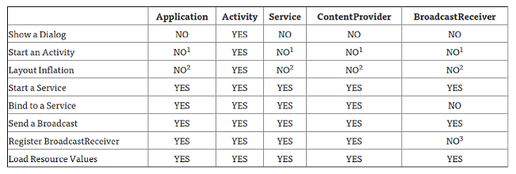

# Android Architektur und Fortgeschrittenes

## Software-Architektur

Zerlegung grösserer Systeme in Teile verbessert Wartbarkeit und Verständlichkeit. **Schichten** gruppieren zusammengehörige Konzepte. Keine Zyklen wenn Abhängigkeiten nur nach unten zeigen. Presentation-Schicht beinhaltet Darstellung und Benutzerinteraktion, stark an UI-Tools gebunden. Domain-Schicht beinhaltet Businesslogik und Domänenklassen. Keine UI Funktionalität, einfach zu testen. Wenig externe Abhängigkeiten. Datenschicht dient der Speicherung, Bereitstellung von Daten. Auch Persistenz oder Datenhaltung genannt. **Variationen**: Mehr als 3 Schichten, zusätzlich vertikale Zerlegung nach Feature, Presentation Patterns (MVC, MVP, MVVM)



Fundament der Software soll nicht Daten sein, sondern Domäne. In der neueren (Clean Code-) **Ringarchitektur** ist auch die Datenbank in der äussersten Schicht, ändert also potenziell oft. Je weiter innen, desto stabiler. "Technische Details" sind aussen. Domäne bildet den Kern.


**Ziele in MGE**: UI Code gruppieren, von restlichem Code trennen und bestmöglich testbar machen.

## Observer Pattern

Dient der "Rückmeldung" von Domain zu Presentation bei Änderungen an den Daten. **Subject/Observable**: Das Ding, das ändern kann, also innerhalb der Domäne. Bietet `Attach()/Detach()`-Funktionen. Eine `Notify()` Funktion führt `Update()` auf allen registrierten **Observern** (GUI-Elementen) aus. Ergo: Observer kennt Subject, umgekehrt nicht. *Wichtig*: Anmelden wenn die App sichtbar ist (`onResume`), abmelden wenn die App im Hintergrund ist (`onPause`). Ansonsten werden unnötige Ressourcen verschwendet, GUI aktualisiert das nicht sichtbar ist. 


Grundlegend "manuelle" Implementation für jedes Objekt, komplex und aufwändig. Wer observiert Wen? An-/Abmelden korrekt überall? Vereinfachte, allgemeine Implementation nötig...

## Grundlagen Architektur

 

**Model View Controller**: Basis (lose) für Android. Kritik: Controller (Activity/Fragments) wird schnell extrem umfangreich und schwierig zu testen wegen Referenzen auf UI. **Model View Presenter:** Keine Verbindung zwischen View und Model. **Model View ViewModel:** Siehe Woche 7.

## Android: Application

Wird im AndroidManifest als `<application>` - Knoten definiert. Instanz wird beim Start der App erstellt - lebt solange die App läuft. Aufbau nach Standard oder selber definiert als abgeleitete Klasse. Kann verwendet werden für einmalige Initialisierungen, erzeugen von Singleton Objekten, Zugriff / Halten von globalen Objekten etc. Hat verschiedene Lifecycle-Methoden wie 
`onCreate, onTerminate` (wird NIE aufgerufen), 
`onConfigurationChanged(newConfig)` bei Änderungen der System-Konfig wie Sprache, Rotation des Geräts, 
`onLowMemory` bei Speicherknappheit, Hinweis auf mögliche Terminierung der App, 
`onTrimMemory(level)` in geeigneten Momente für Aufräumaktion, Parameter gibt Hinweis auf Auslöser.

```xml
<application android:name=".MyApplication"> <!-- Unsere Activities etc..  --> </application>
```

`Application.ActivityLifecycleCallbacks` ist ein Interface, dass implementiert werden kann um von allen Activities die Lifecycle-Events zentral verwalten zu können. Bietet überschreibbare Methoden wie `onActivityCreated()` mit der auslösenden Activity im Parameter. Gut für zentrales Logging etc.

```java
public class MyApplication extends Application implements Application.ActivityLifecycleCallbacks
{
    @Override public void onCreate() { 
	    super.onCreate();
        registerActivityLifecycleCallbacks(this); 	// Wichtig!
    }
    @Override public void onActivityCreated(Activity activity) { /* ... */ }
}
```

## Context

Abstrakte SDK Klasse mit vielen (50+) Ableitungen. Ermöglicht den **Zugriff auf Dienste und Ressourcen** der App. Verschiedene Ableitungen haben verschiedene Möglichkeiten. Activity hat andere "Berechtigungen" als Application. Lebensdauer des Context hängt vom aufrufenden Objekt ab, angeforderte Ressourcen werden wiederum mit dem zugehörigen Context freigegeben. **Vorsicht** beim Weitergeben von Context zwischen verschiedenen Activities etc.. 



## Brodacasts

Sind normale Intent-Objekte, `Action` im Intent definiert den Typ als string mit globaler Namensgebung. Deshalb idealerweise package-Name einbauen. Parameter sind als Intent-Extras möglich. 2 Varianten für Broadcasts:

**Global:** Austausch von Meldungen zwischen Apps. Datenquelle meist Android (auch eigene App möglich). Empfänger verschiedene Apps, die sich registrieren. **Beispiel**: Netzwerkverbindung verloren, SMS empfangen, ...

**Lokal**: Innerhalb App. Bsp. zum Senden von Benachrichtigung, die via Android OS wieder zurück kommt und von einer komplett separaten Komponente verarbeitet werden kann. Für App-Lokale Nachrichten gibt es einen `LocalBroadcastManager`.

Wichtig: keinen sensitiven Daten übermitteln, App-ID integrieren. Ableiten von Basisklasse Broadcast, Registrieren der Klasse auf bestimmte Nachrichten. Alt: im Manifest registriert, nur noch eingeschränkt möglich. Neu dynamisch im Code mit `Context.registerReceiver()`.

## Services

Threads entkoppeln Aufgaben vom UI, Services entkoppeln Aufgaben von einer Activity / der App: Ausführen von Aktionen im Hintergrund, Lebenszyklus unabhängig. Wird auch mittels Intent gestartet.
**Started Services** haben eine klar definierte Lebensdauer, gedacht für einmalige Aufgaben (bsp. Download: klares Ende). UI nur innerhalb einer Notification (Foreground) oder gar keines (Background). Werden etweder durch Service selber `stopSelf`, eine Applikation `service.stopService` oder durch Android beendet. Varianten: `IntentService` und `JobIntentService` für Ausführung einer Aktion im BackgroundThread und automatischer Stopp. `onStartCommand` hat einen Rückgabewert für verschiedene Arten von gewünschten Neustarts: 
`START_NOT_STICKY`:  Automatischer Neustart nur bei unverarbeiteten Intents
`START_STICKY`: Automatischer Neustart mit nächstem anstehenden Intent oder `null`
`START_REDELIVER_INTENT`: Automatischer Neustart mit zuletzt verarbeitetem Intent.
**Bound Services** leben so lange, wie sie verwendet werden (Musikplayer). Nach letztem Disconnect wird der Service gestoppt. Können von verschiedenen Apps oder Activities gesteuert werden. `onBound/onUnbound` bei Verbindung von einer Activity. Ähnlich Client/Server Kommunikation. Registrierung der verwendeten Services im Manifest zwingend. 

```xml
<service android:name=".services.MyStartedService" android:exported="false" />
```

## Deployment

Installation von Apps aus `.apk` Dateien. Dies sind Zip-Archive, können über beliebige Kanäle verteilt werden und enthalten alle zur Ausführung nötigen Daten. `.apk` aus dem Play Store sind von Google signiert, alle anderen gelten als unbekannte bzw. unsichere Apps. Privater Schlüssel als Developer gut aufbewahren, für Updates im Store zwingend nötig. 
**Bundeln** von verschiedenen `.apk` in ein `.aab` (Android App Bundle, Nachfolger von `.apk`) möglich. Beispiel verschiedene Versionen (x86/x64) der App. Aus dem `.aab` wird auf den Google Servern bei Download dynamisch das passende `.apk` generiert (Sprache, CPU, ...). Optimiert die Dateigrösse, bietet verschiedene Delivery Kanäle für Features oder Assets. *Vorteil, der Signaturschlüssel liegt bei Google - Nachteil, der Signaturschlüssel liegt bei Google..* `aab`-Format ist zwingend seit 2021.
**Grössenbeschränkung**: Google Play Store setzt zum Schutz der Infrastruktur ein Limit bei 100 MB für APK / 150MB für AAB.. Möglichkeiten daran vorbei sind APK Splitting (nach verschiedenen Kriterien wie CPU, Gerätetyp.. ) oder APK Expansion Files für grosse Ressourcen wie Videos o.ä. Erlaubt max. 2x 2GB zusätzlich, als `.oob` Dateien oder "Play Asset Delivery" als Alternative.

Inhalt eines APK Files (APK Analyzer in Android Studio):

DEX Format: Optimierte Bytecode-Sprache für Mobile-CPUs. Inhalt `classes.dex`:


### Android Build System

Java Virtual Machine wandelt Bytecode in Maschinencode um. Cold Code wird bei jeder Ausführung interpretiert, Hot Code wird vom JIT-Compiler vorkompiliert und steht direkt als Maschinencode zur Verfügung. Das **Android Asset Packaging Tool** erzeugt `R.java` Klasse sowie alle möglichen Ressourcen.


**DEX-Compiler**: DEX Code ist optimiert für die Ausführung auf Smartphones / mobile CPUs. Ausführung von DEX: früher ganz "Java-Normal", via Android JVM (Name Dalvik). 


**Android Runtime ART 1.0**: Ab Android 5.0 wird das Interpretieren/Kompilieren während der Installation gemacht - Speicherplatz gegenüber Rechenzeit. Neues File-Format `.oat` (Ahead Of Time-Binaries). Grosser Nachteil: Umwandlung DEX auf AOT während Installation, nach Systemupdates von Android, "Optimizing App 1/x"-Screen.


**ART 2.0:** Vom JIT-Compiler wird an Android OS gemeldet, welcher Code Hot-Code ist. Resultierendes AOT-Profile wird verwendet, um Umwandlung von DEX in AOT zu machen. Effizienz-steigerung geschieht also stetig, nach der App-Installation. AOT-Profile können schlussendlich via Google Play Store verteilt werden.

