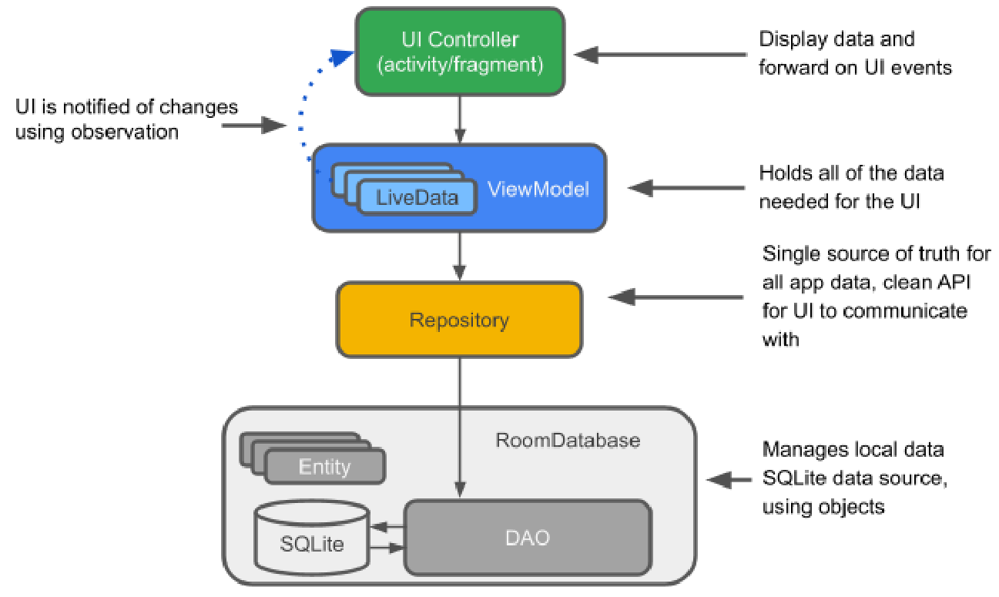

# Android Jetpack

_Nur High Level Konzepte an der Prüfung._

Verschiedene Komponenten der Bereiche Architektur, UI, Foundation Behaviour.
Imports müssen im Gradle File definiert werden (Google Docs -> Dependencies).

Hier: Architektur

Verwenden eher selektiv in Applikationen, evtl. mit Prototypen arbeiten.

## View Binding

Zugriff vom Controller auf die View vereinfachen, ersetzt findViewById Methodenaufrufe.

Erzeugt Binding-Klassen im Hintergrund. Automatische Benennung: activity_main.xml erzeugt ActivityMainBinding Objekt.

## Data Binding

Zugriff von der View auf die Daten vereinfachen.

Variablen im XML generieren, die im Code via `binding` verknüpft werden können.

Im XML können Data Binding Expressions (`@{user.name}`) verwendet werden, um auf Eigenschaften der Variable zuzugreifen.

Komplexere Optionen möglich mit verschiedenen Operatoren, auch zuweisung von OnClickListeners

onClick erwartet fixe Methodensignatur (Rückgabetyp void, Argument vom Typ View).

1. Felder müssen Observable sein

Two Way bindings mit `@={user.age}`

Vorteile: Ermöglicht MVVM Implementierung. Viewmodel abstrahiert die Logik der View, um sie testbar zu machen. Schlankere Activities und Fragmente.

Nachteile: Zu viel Logik im Layout (Expression Language), Model sollte keine android-spezifischen Klassen beinhalten, Erschwert Debugging bei Fehlern, kompiliert langsamer, unsichtbare Observer

## MVVM

Zuständig für

- Zustände von Buttons
- Verifikation von Input

Activity generiert nur noch View und verknüpft ViewModel.
ViewModel "Versteckt" das Model Objekt und beinhaltet Logik.

Lifecycle-Aware components setzen das Observer Pattern um.

Objekt mit Lebenszyklus wird observiert.

Klasse Lifecycle kapselt den Zustand des beobachteten Objekts. Event wird an alle registrierten Observer geschickt.
Kennt Methode `getLifecycle()` zur Übergabe des eigenen Lifecycle an den Listener.

LifecycleObserver kann dann annotierte Methoden verwenden

```java
@OnLifeCycleEvent
void start() {
    }
```

### Variante: LiveData

Lifecycle-aware Observable: Datenobjekt, dass nur liefert, wenn das zugrundeliegende Objekt aktiv ist. Alternative zu ObservableFields / ObservableClasses.

`new MutableLiveData<string>()`

Room liefert LiveData zurück wenn so konfiguriert.

### Standardarchitektur für Android Apps


