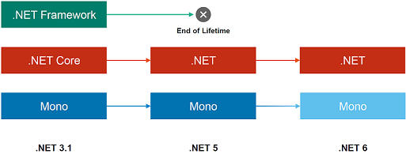

# MAUI Einführung

## .NET Runtime

**.NET Framework**: Single Platform Windows, **.NET Core**: Cross-Platform Desktop, **Mono**: Mobile Crossplatform. Seit .NET 5 wird vereinheitlicht: Reduktion der Runtimes, einheitliche Base Class Library, Tooling, Naming. 
**.NET Standard** beinhaltet die Gemeinsamkeiten der verschiedenen Base Class Libraries. **Faustregeln**: .NET Standard 2.0 für .NET Framework, .NET Standard 2.1 für Mono/Xamarin, .NET 6.0 aufwärts für alles andere (Desktop sowie Mobile).



**NuGet:** Paketmanager im .NET Umfeld. Open Source, öffentlich auf nuget.org oder private Hosts, `.nupkg` Dateien sind ZIP Files.
**XAML:** XML-basierte Beschreibungssprache für grafische Oberflächen. Hierarchisch Strukturiert, trennt Layout von Code. Verwendet verschiedene "Dialekte" für verschiedene UI Frameworks *(WPF, UWP, WinUI, Xamarin, Maui, ...)*. Standardisierung wurde gestoppt.

## .NET MAUI - Cross Platform UI Framework

- Bestandteile: UI und Non-UI Komponenten
- Basiert auf **.NET 6** oder neuer
- Funktionsweise: **Shared Code** verwendet nur abstrakte Elemente aus MAUI und ist für alle Zielplattformen gedacht. **Platform Code** verwendet Elemente aus dem darunterliegenden UI Framework und muss für jede Plattform separat geschrieben werden. Appicon als Bsp. wird einmal eingefügt im Resources Ordner und plattformspezifisch weiterverwendet. Ebenso Projekteinstellungen: Entweder zentral für alle, oder spezifisch überschreiben.

- Kompilierung: **Android** Just In Time (DEX Code und IL Code), **iOS**: Ahead of Time AOT, Runtime in Maschinensprache. Von Apple vorgeschrieben.
- app.xaml entspricht android Application.java
- **Debug Konfiguration** für Entwicklung (höherer Speicherbedarf, keine Code Optimierung, Kompilat mit Debug-Infos) vs. **Release Konfiguration** (ohne Debug-Infos, optimierter Code, weniger Speicher)
- Single Project: Ein Projekt beinhaltet alles, was für die Ausführung auf verschiedenen OS nötig ist.
- XAML / Markup, C# Code Behind und C# Generierter Code definieren die **Applikation in 3 Teilen**.
- XAML Baumstruktur kann gleichwertig auch in C# definiert werden. Wird aber schnell umständlich.

### Projektstruktur

| Ordner/File      | Was                                          |
| ---------------- | -------------------------------------------- |
| `Platforms/`     | Plattform-spezifischer (Startup-)Code        |
| `Resources/`     | Für alle Plattformen verwendet               |
| `App.xaml`       | Einstiegspunkt in MAUI-Applikation           |
| `AppShell.xaml`  | Definition der visuellen HIerarchie (Shell)  |
| `MainPage.xaml`  | Inhalt des ersten Fensters der App           |
| `MauiProgram.cs` | Bootstrapping der MAUI-Applikation (Builder) |


### Projekteinstellungen

Definieren Application Title, ID, GUID und Versionierung (Version und DisplayVersion).

### Basic "Glue"

```xaml
<Application xmlns="http://schemas.microsoft.com/dotnet/2021/maui" 
             x:Class="Vorlesung_08.App"></Application> <!-- verbindet XAML und C# -->
```

```csharp
namespace Vorlesung_08;
public partial class App : Application
{
    public App()
    {
        InitializeComponent(); MainPage = new AppShell();
    }
}
```

**Build Action** in Visual Studio Properties Fenster ist für XAML Files als *"MauiXaml"* festgelegt.

## Refresher C#

Common Language Runtime ist die Ausführende Instanz, MSIL Microsoft Intermediate Language (Assembler-Like) als Zwischensprache.

Wichtige Objekte:

```csharp
// Properties
public string LastName
{
    get { return _lastName; }
    set { _lastName = value; }
}
// Delegates
delegate int Calculation(int a, int b);
public delegate void Action<T>(T t);
public delegate TResult Func<T, U, TResult>(T t, U u);
// Events
public event EventHandler<string> SomeThingChanged;
SomeThingChanged?.Invoke(this, newValue);
// Lambdas
Func<int, int> func1 = delegate (int x) { return x + 1; };
Func<int, int> func3 = x => x + 1;
Func<int, int> func6 = (int x) => { return x + 1; };
Action func8 = () => Console.WriteLine();
```
