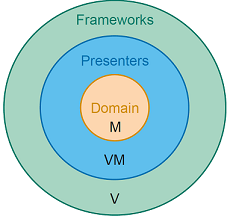

# MAUI MVVM

## Architektur-Varianten


**Lose Kopplung** VM und V nur durch Data Binding (Testbarkeit). **Starke Kopplung** VM <-> M mit Methoden und Events. 
VM Property: muss von der View observierbar sein, VM Command: Standardisierte, gekapselte Funktionen.

## Komponenten

- View: XAML + Code Behind, Ressourcen, Value Converter etc. Möglichst wenig Logik, da schwer testbar. Wiederverwenden von Styles, Auslagern von Item Templates.
- View Model: C# Klasse mit INPC, Logik und Zustände der View. Beispiele: Halten von Zuständen, Verarbeitung von Selektionen, Steuerung von Sicht- und Verfügbarkeiten, Formatierung von Model-Eigenschaften, Validieren von Benutzereingaben etc.
- Model: C# Klassen, oft auch nur Interfaces (führt von starker zur schwacher Kopplung mit VM). Domänen- und Business Logik, meistens langlebig.

Schichten können verschieden angelegt werden


MVVM in Clean Architecture:



## ViewModel in .NET MAUI

### Varianten

**Klassisch:** Alle Zustände werden im ViewModel gehalten, evtl. auf Gültigkeit geprüft. Speichern ins Model normalerweise bei Save Button Click oder Verlassen des Screens. ViewModel Observable implementieren.
**Durchgriff** View <-> Model möglich: Model muss Observable sein (statt ViewModel). Property im ViewModel kann der ganze User als Objekt sein. *Probleme*: Zusätzliche Logik kann nicht mehr im ViewModel sein, entweder in View oder im Model -> unschön, verteilt, weniger klar, Model nicht mehr frei von Technologiedetails ...
**AutoMapper** vermindert den nötigen Glue Code in der klassischen Variante. Objekt-Objekt-Mapping, kann ViewModel aus Model automatisiert erzeugen.

```csharp
var config = new MapperConfiguration(cfg => cfg.CreateMap<User, UserViewModel>());
var mapper = config.CreateMapper();
var viewModel = mapper.Map<UserViewModel>(user);
```

| Aspekt                                           | Klassisch         | Durchgriff        |
| ------------------------------------------------ | ----------------- | ----------------- |
| MVVM-Implementierung "nach Lehrbuch"             | Ja                | Nein              |
| Saubere Trennung der Bereich                     | Ja                | Nein              |
| Änderungen am Model haben Einfluss auf ViewModel | Ja                | Nein (normalerw.) |
| Änderungen am Model haben Einfluss auf View      | Nein (normalerw.) | Ja                |
| Model frei von technologischen Details           | Ja                | Nein              |
| Tendenz zu versteckter Darstellungslogik         | Klein             | Gross             |
| Umfang des Codes (Glue Code)                     | Grösser           | Kleine            |

### Aktionen

`ICommand` kapselt eine Methode passend für Data Binding. Definiert eine Schnittstelle für Aktionen, die via Button etc. ausgelöst werden können. Alle Aktions-Views haben eine Eigenschaft Command, erwartet Objekt vom Typ `ICommand`. Beinhaltet zwei Funktionen `void Execute(Object parameter)` und `bool CanExecute(Object parameter)`. Event `CanExecuteChanged` prüft und steuert, ob ein Button clickable ist oder nicht. Muss bei jeder Änderung innerhalb der Vorgaben ausgelöst werden. 


**Variante 1 manuell**: Eigene Implementierung von `ICommand` definiert beide Aktionen, explizit für den gegebenen Anwendungsfall.

```csharp
public class DecreaseAgeCommand : ICommand
{
	public bool CanExecute(object parameter) { return _viewModel.Age > 0; }
    public void Execute(object parameter) { _viewModel.Age--; OnCanExecuteChanged(); }
}
```

**Variante 2 mit RelayCommand**: Logik bleibt im ViewModel, 2 Methoden (`Execute` und `CanExecute`) wird beim Aufruf an RelayCommand Implementierung mitgegeben. *(RelayCommand in .NET Community Toolkit enthalten)*

```csharp
public sealed class RelayCommand : ICommand
{
    private readonly Action _execute;
    private readonly Func<bool> _canExec;
    public RelayCommand(Action execute, Func<bool> canExec)
    {
        _execute = execute; _canExec = canExec;
    }
    public bool CanExecute(object paramter) => _canExec();
    public void Execute(object parameter) => _execute();
    public event EventHandler CanExecuteChanged;
    public void RaiseCanExecuteChanged() { CanExecuteChanged?.Invoke(this, EventArgs.Empty); }
}
```

*Command mit Parameter*: theoretisch möglich, macht aber keinen Sinn. Parameter kommt normalerweise vom ViewModel, Command auch. Zugriff ist somit auch direkt möglich.

## Tipps zur Umsetzung

**Strukturierung von Code**
Domänenlogik, wird evtl. mehrfach verwendet? -> __Model__
Ist die Logik unabhängig vom verwendeten UI Framework? -> __View Model__
Rest (Reine Darstellung): -> __View__

**Zu ViewModels:** Varianten zur Erstellung


Logik, die nur in der (UI-spezifischen) View Schicht ausgeführt werden kann, soll via Events implementiert werden. **Navigation:** Command auf ViewModel prüft Vorbedingungen und löst einen Event für die View aus.
Weitere: Errors darstellen, etc.


### Nützliche Libraries

Von Microsoft gepflegt: **.NET Community Toolkit**: leichtgewichtiges Addon für .NET UI Technologien. **.NET MAUI Community Toolkit:** Zusatzfunktionalität MAUI wie Views, Layouts, Value Converter.
Weitere: **Persistenz:** Entity Framework, SQLite.net **Datenübertragung:** RestSharp, Json.NET, protobuf-net


