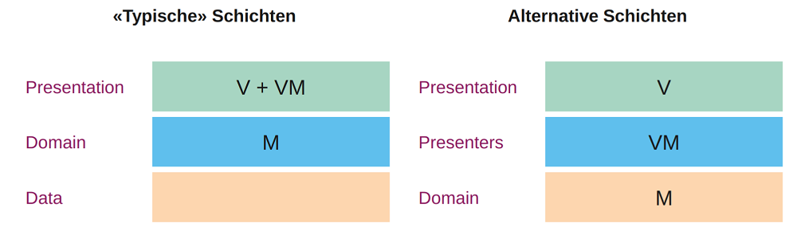

# MAUI MVVM

## Bestandteile von MVVM

Ziel von Softwarearchitektur ist in erster Linie Wartbarkeit.

Schicht: Namespace, Assembly, ... Wichtig: Schnell finden und austauschen.


_Grün: Presentation Schicht_  
_Blau: Domain_

Viewmodel und View __nur__ mit Data Binding. Grund: Testbarkeit


Property: muss von der View observierbar sein

Command: Standardisierte, gekapselte Funktionen


## Komponenten

- View: XAML + Code Behind, möglichst wenig Logik da schwer testbar
- View Model: C# Klasse mit INPC, Logik und Zustände der View
- Model: C# Klassen, oft auch nur Interfaces (führt von starker zur schwacher Kopplung mit VM). Business Logik, langlebig

Schichten können verschieden angelegt werden


Clean Architecture: Ringe mit Domain in der Mitte.

## Varianten MVVM

- Klassisch:  
Alle Zustände werden im ViewModel gehalten, evtl. auf Gültigkeit geprüft. Speichern ins Model normalerweise bei Save Button Click oder Verlassen des Screens.

- Durchgriff View <-> Model möglich:  
Model muss Observable sein (BindableBase implementieren).
Property im ViewModel kann der User als ganzes Objekt sein.
Probleme: Zusätzliche Logik kann nicht mehr im ViewModel sein, entweder in View oder im Model -> unschön, verteilt, weniger klar, Model nicht mehr frei von technologiedetails ...

xxxxxxxxxx <Label Text="{AppThemeBinding Dark='Theme: Dark'                Light='Theme: Light'                Default='Theme: ???'}" />sdxaml

## ViewModel in .NET: Aktionen

`ICommand` definiert eine Schnittstelle für Aktionen, die via Button etc. ausgelöst werden können. Alle Aktions-Views (Button, etc.) haben eine Eigenschaft Command (erwartet Objekt vom Typ `ICommand`).

Beinhaltet zwei Funktionen `void Execute(Object parameter)`, `bool CanExecute(Object parameter)`

Event `CanExecuteChanged` prüft und steuert, ob ein Button clickable ist oder nicht. Muss bei jeder Änderung innerhalb der Vorgaben ausgelöst werden.

Variante 1 mit eigenem Command:  
Eine eigene Implementierung von ICommand definiert beide Aktionen, explizit für den gegebenen Anwendungsfall.

```csharp
public class DecreaseAgeCommand : ICommand
{
	public bool CanExecute(object parameter) { return _viewModel.Age > 0; }
    public void Execute(object parameter) { _viewModel.Age--; OnCanExecuteChanged(); }
}
```

Variante 2 mit RelayCommand:  
Logik bleibt im ViewModel, 2 Varianten (Execute und CanExecute) wird beim Aufruf an RelayCommand Implementierung mitgegeben.

```csharp
public sealed class RelayCommand : ICommand
{
    private readonly Action _execute;
    private readonly Func<bool> _canExec;
    public RelayCommand(Action execute, Func<bool> canExec)
    {
        _execute = execute;
        _canExec = canExec;
    }
    public bool CanExecute(object paramter) => _canExec();
    public void Execute(object parameter) => _execute();
    public event EventHandler CanExecuteChanged;
    public void RaiseCanExecuteChanged() { CanExecuteChanged?.Invoke(this, EventArgs.Empty); }
}
```

Command mit Parameter: theoretisch möglich, macht aber keinen Sinn. Parameter kommt normalerweise vom ViewModel, Command auch. Zugriff ist somit auch direkt möglich.

## Tipps zur Umsetzung

### Strukturierung von Code

Domänenlogik, wird evtl. mehrfach verwendet? -> __Model__

Ist die Logik unabhängig vom verwendeten UI Framework? -> __View Model__

Rest (Reine Darstellung): __View__

### Zu ViewModels

Varianten zur Erstellung:


Logik, die nur in der (UI-spezifischen) View Schicht ausgeführt werden kann

- Navigation, wird durch Event vom ViewModel gehandhabt.


- Errors darstellen
- etc...

### Nützliche Libraries

Von Microsoft gepflegt, könnte eigentlich Standardbestandteil sein..

- .NET Community Toolkit:  
leichtgewichtiges Addon für .NET UI Technologien
- .NET MAUI Community Toolkit:  
Zusatzfunktionalität MAUI: View, Layouts, Value Converter

- Persistenz: Entity Framework, SQLite.net
- Datenübertragung: RestSharp, Json.NET, protobuf-net


_T-Shirt vorne_  
W.W.T.D

_T-Shirt hinten_
..dasselbe wie jeder normal vernünftig denkende Mensch.

.. werdet ihr in der Praxis so nie sehen.