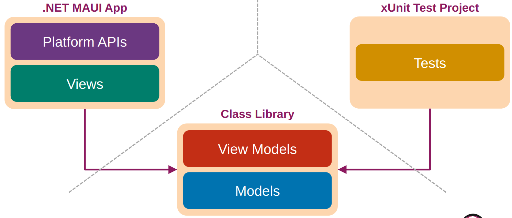
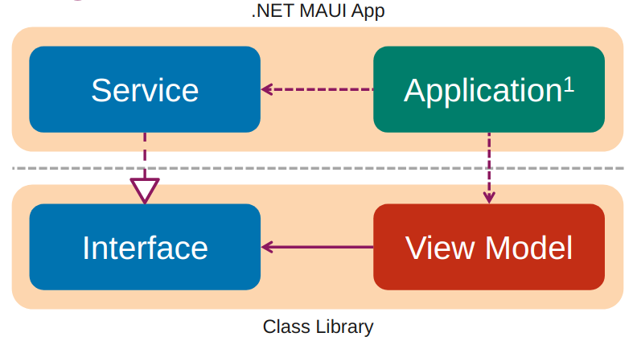
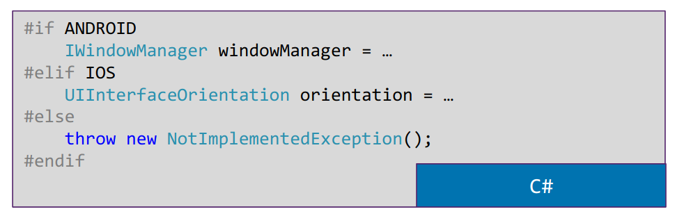
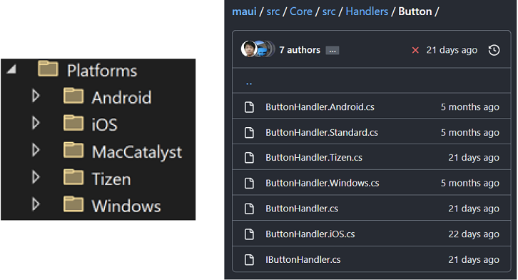
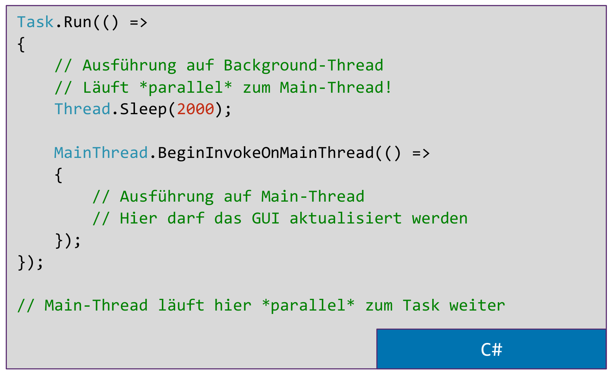

# Woche 13

## Solution Design

Ziel: Trennung von UI und Nicht-UI, aufgrund Testbarkeit.

Zerlegung von Software in Teile: Wartbarkeit, Qualität, Überblick.

Trennung möglich nach technischer Verwendung, Fachlichkeit, Organisation.

Horizontal: Technische Trennung, traditioneller Ansatz
- Geeignet für Technologie Teams
- Austausch von Technologien wird einfacher

Vertikal: Fachliche Trennung, modernerer Ansatz
- agile Implementation nach Features
- Geeignet für Feature Teams
- Technologie-Austausch schwieriger

Kombination: Trennung fachlich, innerhalb dann nochmals nach Technik
Kleinprojekte: Keine Trennung nötig, Übersicht ist gegeben.

Technologische Trennung: .NET MAUI spezifisch separat, alles andere zusammen

### Projekttypen

Class Library - Standard Projektform, ergibt eine DLL. Beinhaltet View Model, Model

.NET MAUI Projekt - Platform APIs und View, greift auf die Class Library zu

Test Projekt - Greift ebenfalls auf die Class Library zu

## Dependency Inversion Principle

### Dependency Injection

Vorteile:
- Geringere Kopplung
- Separation of Concerns
- Austauschbarkeit
- Erhöhte Testbarkeit
- Weniger Glue Code im Client

Nachteile:
- Zusätzliche Komplexität
- Erschwertes Debugging
- Parameterliste wächst bei vielen Abhängigkeiten
- Mehr Glue Code im Injector

### DI Container
Übernimmt die Zuweisung von Interface und expliziter Implementation. Kann zur einfacheren Erstellung von z.B. View Models verwendet werden.

### Platform Integration .NET MAUI

MAUI bietet viele APIs für plattformspezifische Funktionen an. Filezugriff, Main Thread, Browser, Karten, etc... 

Gibt es keine MAUI API, muss für jede Plattform eine eigene Implementierung gemacht werden.

Conditional Compilation (unschön)

Multi Targeting

## Threading

Android: ANR Screen wenn UI Thread blockiert ist.

Exceptions / nicht möglich: 

- Langlaufende Operation auf Main Thread
- Aktualisierung des GUI aus Background Thread

.NET Lösungen zum Threading

- Task
- async / await
- Parallel LINQ (PLINQ)

Run mit Tasks 

Data Binding in MAUI: Aktualisierung von Views im UI wird nach Data-Bound Funktionen automatisch auf dem Main Thread ausgeführt

CanExecute muss im Relay Command ein Dispatch auf Main Thread machen...

## Mehrsprachigkeit

### Variante: Resources

Einzelne Datei mit String Resources pro Sprache, die die Übersetzungen beinhalten. Zugriff via MarkupExtension StaticResoure/DynamicResource.

Mit DynamicResource: key der Resource ist gleich, laden eines anderen File via Reflection.

_Variante ist spezifisch .NET MAUI. Zugriff von Non-UI schwierig._

### Variante: RESX -> Standard .NET 

RESX: XML Resources
Selbe Strings in speziellen REX-Files

Ein File pro Sprache. .NET generiert eine Klasse mit demselben Namen wie das File. 
Via Markup Extension x:Static kann auf normale .NET Klassen zugegriffen werden. t:Translations.Key1 bezeichnet den genauen Wert.

Zugriff auf die generierte Klasse aus jedem C# File möglich.

Nachteile: UI aktualisiert nicht automatisch, statisch eingebunden.

### Translation Service

Verstecken der MAUI-Resources Funktionalität hinter einem Interface um einen TranslationService anzubieten. Gut für Austauschbarkeit.